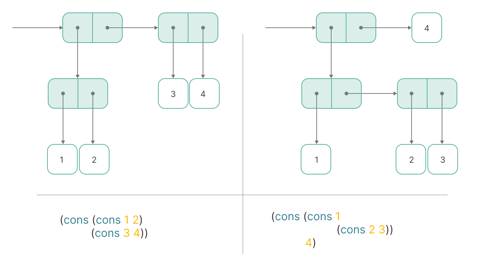

<h1 align="center">TS-Expression</h1>

<p align="center">
Constructor of TypeScript <a href="https://en.wikipedia.org/wiki/S-expression">symbolic expressions</a>.
</p>

<p align="center">
  <a href="https://github.com/hnatiukr/ts-expression/actions/workflows/workflow.yml">
  
  </a>
  <a href="https://www.npmjs.com/package/ts-expression">
    
  </a>
  <a href="https://github.com/hnatiukr/ts-expression">
    
  </a>
</p>

```ts
import { cons, car, cdr } from 'ts-expression';

const makePoint = (a, b) => cons(a, b);
const getX = (point) => car(point);
const getY = (point) => cdr(point);

const getSymmetricalPoint = (point) => {
  const x = getX(point);
  const y = getY(point);

  return makePoint(-x, -y);
};

const calculateDistance = (point1, point2) => {
  const [x1, y1] = [getX(point1), getY(point1)];
  const [x2, y2] = [getX(point2), getY(point2)];

  return Math.sqrt((x2 - x1) ** 2 + (y2 - y1) ** 2);
};

//

const point1 = makePoint(3, 4);
const point2 = makePoint(0, 0);

getX(point1); // 3
getY(point2); // 0
distance(point1, point2); // 5
getSymmetricalPoint(makePoint(1, 5)); // makePoint(-1, -5)
calculateDistance(makePoint(-2, -3), makePoint(-4, 4)); // ≈ 7.28
```

## About

TS-Expression is a lightweight TypeScript library inspired by LISP's [`cons/car/cdr`](https://en.wikipedia.org/wiki/CAR_and_CDR) operations for S-expressions. It brings functional programming concepts to TypeScript, enabling immutable data structures and encouraging robust, predictable code. This minimalist approach to handling complex data structures is particularly useful for algorithmic tasks and data manipulation, allowing developers to leverage powerful functional programming techniques in a familiar JavaScript/TypeScript environment.

<p align="center">
  
</p>

## Installation

Via npm

```sh
npm install ts-expression
```

Via yarn

```sh
yarn add ts-expression
```

Via pnpm

```sh
pnpm add ts-expression
```

Via bun

```sh
bun add ts-expression
```

## Documentation

### cons

Constructs a `cons` symbolic expression from two values, `car` and `cdr`.

This function creates a symbolic expression that allows access to its `car` (first/left element) and `cdr` (second/right element)
using specific messages. The resulting s-expression is an immutable structure where `car` and `cdr` can be
accessed via the messages `CAR` and `CDR`, respectively.

#### Parameters

- `car` **CAR** The first/left element of the s-expression.
- `cdr` **CDR** The second/right element of the s-expression.

#### Examples

```ts
// Creating a symbolic expression with a number and a string
const sexp = cons(5, 'hello');

// Accessing the first element using `CAR`
const five = sexp(CAR); // 5

// Accessing the second element using `CDR`
const hello = sexp(CDR); // 'hello'
```

- Throws **[Error][9]** Throws an error if an unknown message is provided to the `cons` s-expression.

Returns **Cons\<CAR, CDR>** A `cons` s-expression, which is a function that returns the `car` or `cdr`
based on the provided message.

### car

Retrieves the first element of a `cons` symbolic expression (known as `car`).

This function returns the `left` element of a symbolic expression created by the `cons` function. It ensures that
the provided argument is a valid `cons` symbolic expression before attempting to access the element.

#### Parameters

- `cons` **Cons\<CAR, CDR>** The `cons` symbolic expression from which to retrieve the first element.

#### Examples

```ts
// Example usage
const sexp = cons(5, 'hello');

// Retrieves the first element of the symbolic expression
const five = car(sexp); // 5
```

- Throws **[ReferenceError][8]** Throws an error if the provided argument is not a valid `cons` symbolic expression.

Returns **CAR** The first element (`car`) of the `cons` symbolic expression.

### cdr

Retrieves the second element of a `cons` symbolic expression (known as `cdr`).

This function returns the `right` element of a symbolic expression created by the `cons` function. It ensures that
the provided argument is a valid `cons` symbolic expression before attempting to access the element.

#### Parameters

- `cons` **Cons\<CAR, CDR>** The `cons` symbolic expression from which to retrieve the second element.

#### Examples

```ts
// Example usage
const sexp = cons(5, 'hello');

// Retrieves the second element of the symbolic expression
const hello = cdr(sexp); // 'hello'
```

- Throws **[ReferenceError][8]** Throws an error if the provided argument is not a valid `cons` symbolic expression.

Returns **CDR** The second element (`cdr`) of the `cons` symbolic expression.

### toString

Converts a `cons` symbolic expression into its string representation, handling nested `cons` s-expression recursively.

This function generates a string representation of a `cons` s-expression by retrieving its `car` and `cdr`
elements, converting them to strings using `JSON.stringify`, and formatting them in a tuple-like format.
If either `car` or `cdr` is a nested `cons` s-expression, the function will recursively convert those elements
to strings as well.

#### Parameters

- `cons` **Cons\<CAR, CDR>** The `cons` s-expression to be converted to a string.

#### Examples

```ts
// Example usage
const sexp = cons(cons(1, 2), cons('hello', 'world'));

// Convert the nested symbolic expression to a string
const str = toString(sexp); // "((1, 2), ("hello", "world"))"
```

- Throws **[ReferenceError][8]** Throws an error if the provided argument is not a valid `cons` s-expression.

Returns **[string][10]** A string representation of the `cons` s-expression, including nested s-expressions, in the format `(head, tail)`.

## isCons

Checks if the provided argument is a `cons` symbolic expression.

This function determines if the given value is a `cons` s-expression by checking if it is a function and has
a specific `init` property set to `true`. This property is used as a marker to identify `cons` s-expression,
which are functions with the `init` property indicating their construction.

#### Parameters

- `maybeCons` **any** The value to be checked. It can be of any type.

#### Examples

```ts
// Example of a valid cons
const sexp = cons(5, 'hello');

// Checking if it's a cons
const isValid = isCons(sexp); // true

// Example of an invalid cons
const notSexp = { car: 5, cdr: 'hello' };

// Checking if it's a cons
const isInvalid = isCons(notSexp); // false
```

Returns **[boolean][7]** `true` if the argument is a `cons` symbolic expression; otherwise, `false`.

### assertCons

Asserts that the provided argument is a valid `cons` s-expression and throws a `ReferenceError` if it is not.

This function checks whether the given argument is a valid `cons` s-expression using the `isCons` function.
If the argument is not a valid s-expression, an error is thrown with a detailed message that includes
the serialized form of the invalid argument.

#### Parameters

- `maybeCons` **any** The value to be checked, which can be of any type.

#### Examples

```ts
// Example of a valid cons
const sexp = cons(5, 'hello');

// Asserting the cons, no error is thrown
assertCons(sexp);

// Example of an invalid cons
const notSexp = { car: 5, cdr: 'hello' };

// Asserting the non-s-expression, an error is thrown
assertCons(notSexp); // Throws ReferenceError: Argument must be a symbolic expression, but it was '{"car":5,"cdr":"hello"}'
```

- Throws **[ReferenceError][8]** Throws an error if the provided argument is not a valid `cons` s-expression.

Returns **void**

[1]: #iscons
[2]: #assertcons
[3]: #car
[4]: #cdr
[5]: #cons
[6]: #tostring
[7]: https://developer.mozilla.org/docs/Web/JavaScript/Reference/Global_Objects/Boolean
[8]: https://developer.mozilla.org/docs/Web/JavaScript/Reference/Global_Objects/ReferenceError
[9]: https://developer.mozilla.org/docs/Web/JavaScript/Reference/Global_Objects/Error
[10]: https://developer.mozilla.org/docs/Web/JavaScript/Reference/Global_Objects/String

## Examples

Rational numbers as pairs of values: numerator and denominator.

```typescript
const make = (numer, denom) => cons(numer, denom);

const numer = (rat) => car(rat);

const denom = (rat) => cdr(rat);

const toString = (rat) => `${numer(rat)} / ${denom(rat)}`;

const isEqual = (rat1, rat2) => numer(rat1) * denom(rat2) === denom(rat1) * numer(rat2);

const add = (rat1, rat2) => {
  const [a, b] = [numer(rat1), denom(rat1)];
  const [c, d] = [numer(rat2), denom(rat2)];

  return make(a * d + b * c, b * d); // (a * d + b * c) / (b * d)
};

const sub = (rat1, rat2) => {
  const [a, b] = [numer(rat1), denom(rat1)];
  const [c, d] = [numer(rat2), denom(rat2)];

  return make(a * d - b * c, b * d); // (a * d - b * c) / (b * d)
};

const mul = (rat1, rat2) => {
  const [a, b] = [numer(rat1), denom(rat1)];
  const [c, d] = [numer(rat2), denom(rat2)];

  return make(a * c, b * d); // (a * c) / (b * d)
};

const div = (rat1, rat2) => {
  const [a, b] = [numer(rat1), denom(rat1)];
  const [c, d] = [numer(rat2), denom(rat2)];

  return make(a * d, b * c); // (a * d) / (b * c)
};

//

const rat1 = make(2, 3);
const rat2 = make(4, 6);
const rat3 = make(7, 2);

toString(rat2); // '4 / 6'
isEqual(rat1, rat2); // true

add(rat1, rat3); // 25/6
sub(rat3, rat1); // 17/6
mul(rat1, rat3); // 14/6
div(rat1, rat3); // 4/21
```

## Inspirations

I’ve embraced the ["Structure and Interpretation of Computer Programs" (SICP)](https://mitp-content-server.mit.edu/books/content/sectbyfn/books_pres_0/6515/sicp.zip/index.html) and LISP's abstractions to deeply understand and appreciate functional programming and data manipulation. These foundational concepts highlight the power of simple, immutable data structures in building complex systems, emphasizing clarity and expressive power in code.
